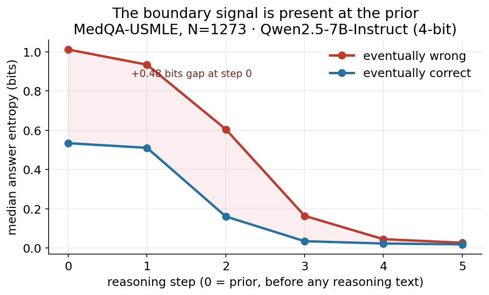
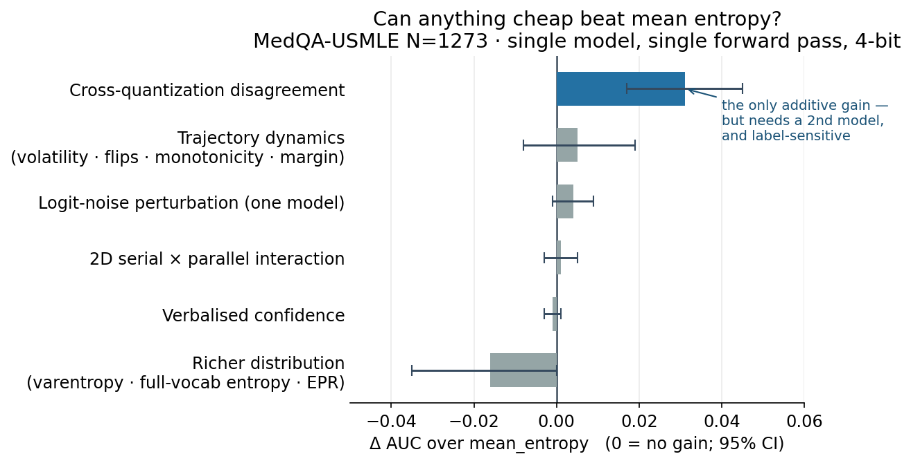

# A Measurement Protocol for Per-Step Belief Monitoring in Chain-of-Thought Reasoning

**Status**: full draft, all sections (§1-§9) populated; pending PI
review pass and venue formatting.
**Authors**: Nicolás Vera Zúñiga (Quetru Ltda.). Co-authors TBD.
**Date**: 2026-05-07 (started); 2026-06-12 (full-draft revision
integrating the parallel-axis and signal-exhaustion results).
**Empirical evidence base**: stage-4a MedQA-USMLE N=1273 replication
(``docs/exploration/2026-05-05-stage-4a-replication-n1273.md``),
stage-4b MMLU professional_law N=1534 cross-domain replication
(``docs/exploration/2026-05-06-stage-4b-mmlu-professional_law.md``),
cross-quantization probes (``docs/decisions/prereg_2d_interaction_probe.md``,
``docs/decisions/prereg_confident_disagree_triage_flag.md``), and the
exploratory signal-exhaustion probes (scripts 16-18 in
``experiments/medqa_generalization/scripts/``, artifacts under
``artifacts/medqa-*-probe/``).

---

## Outline

1. **Abstract** (this section, below)
2. **Introduction** (§1, drafted)
3. **Related work** (§2, drafted)
4. **The measurement protocol** (§3, deferred)
   - 3.1 Token-probability measurement at per-step boundaries
   - 3.2 Renormalisation over hypothesis space + mass capture as
     measurement-quality field
   - 3.3 Sign-aware AUC reporting
   - 3.4 The trajectory data model
   - 3.5 What the protocol *measures* and what it does not claim
5. **Datasets and protocol** (§4, deferred)
   - 4.1 MedQA-USMLE 4-option
   - 4.2 MMLU subject-filtered (professional_law primary; 4 secondary
     subjects in smoke)
   - 4.3 Model and inference: qwen2.5:7b-instruct via llama.cpp
6. **Empirical results** (§5, deferred)
   - 5.1 mean_entropy as per-trajectory deferral signal
   - 5.2 Cross-domain replication (medical → legal)
   - 5.3 Component comparison: composite vs single-component
   - 5.4 B-vs-C complementarity (the framework's distinctive contribution)
   - 5.5 Boundary-signal-at-prior pattern
   - 5.6 Mass-capture: a pre-registered mechanism that does not survive
   - 5.7 Cross-quantization disagreement: additive feature, not a 2D
     interaction; label-sensitivity; confident-but-disagreeing triage flag
   - 5.8 The serial axis is exhausted: trajectory-dynamics features add
     nothing beyond mean entropy (exploratory negative results)
7. **Discovery sequence and pre-registration discipline** (§6, deferred)
   - 6.1 Pre-registration revisions before each experimental wave
   - 6.2 Calibrated-claims discipline as a positive contribution
   - 6.3 What the discipline rules out
8. **Discussion** (§7, deferred)
   - 7.1 Scope: single-trajectory MCQ
   - 7.2 What stage-6 (chest-pain MIMIC-IV) is designed to test
   - 7.3 Methodology-vs-deployment-use distinction
   - 7.4 Limits, threats to validity
9. **Conclusion** (§8, deferred)
10. **Methods appendix**: framework architecture, ADR pointers,
    cross-adapter agreement plan.

---

## Abstract

Chain-of-thought (CoT) reasoning produces a sequence of intermediate
states between a prompt and an answer. Each state carries the
language model's evolving belief over the answer space, which is
information about the model's confidence at that step but is rarely
measured directly. We introduce a token-probability measurement
protocol that reads the model's next-token distribution at each
reasoning-step boundary, renormalises over the answer-letter space,
and records (a) the renormalised conditional, (b) the mass-capture
fraction (the share of next-token probability that landed on the
answer space before renormalisation), and (c) the full top-K
log-probabilities at full fidelity. From this protocol we derive
per-trajectory scorers — mean entropy, plateau slope, distance from
trajectory, mass-capture aggregations — and evaluate them against
ground-truth answer correctness on two large-scale closed-MCQ-format
benchmarks: MedQA-USMLE (N=1273) and MMLU professional_law
(N=1534). The strongest single-component scorer, **mean entropy
across the trajectory**, achieves AUC 0.686 [0.657, 0.716] on MedQA
and replicates cross-domain at AUC 0.664 [0.636, 0.690] on
professional_law. The framework's distinctive contribution — that
mean entropy adds discriminative information *complementary* to the
model's verbalised confidence — replicates strongly: in the cell
where the model reports high confidence and our protocol reports
high entropy, wrong-rate lift over base rate is +16.36pp on MedQA
and +12.60pp on professional_law, both with 95% confidence intervals
cleanly excluding zero. We further show that the boundary signal is
present at the prior measurement (the model's pre-reasoning
distribution already separates eventually-wrong from
eventually-correct trajectories), and that a hypothesised
mass-capture deferral signal, which appeared compelling at small
sample sizes, fails to replicate at scale on either domain — a
falsification preserved by pre-registered prediction discipline.
On the parallel axis, cross-quantization disagreement
(Jensen-Shannon divergence between the answer distributions of two
4-bit quantizations of the same model) adds incremental signal
*additively* over mean entropy (ΔAUC +0.031 [+0.017, +0.045] on
direct-prompt correctness), but the gain is label-sensitive — it
attenuates to non-significance on the chain-of-thought terminal
prediction — and a pre-registered 2D interaction between the serial
and parallel axes is null. A pre-registered confident-but-disagreeing
triage flag validates on a held-out second base model (flagged-cell
wrong-rate 0.657 vs 0.234, CI excluding base rate) at ≈5% coverage.
A systematic exploratory sweep of trajectory-*dynamics* features —
step-to-step belief volatility, argmax flips, monotonicity
violations, margin trajectories, out-of-answer-space mass — finds
every dynamics feature weaker than mean entropy with no
complementary contribution; single-model logit-noise perturbation
and verbalised confidence likewise add nothing; and a new-inference
test of richer-distribution features (varentropy, full-vocabulary
entropy, entropy-production rate) on the full next-token
distribution is also null. On short-step closed-MCQ reasoning, the
within-trajectory serial information collapses to the entropy level,
and the cheap single-model measurement ceiling sits at ≈0.69 AUC. We
report the calibrated-claims discipline as a methodological
contribution: each empirical claim is pre-registered with quantitative
thresholds, sign-aware AUC reporting prevents directional
misinterpretation, and pre-registration revisions occur on
accumulated evidence before subsequent waves of data collection.
These findings are obtained under resource-constrained deployment —
single-run inference on a 4-bit-quantized 7B model on commodity Apple
Silicon, no fine-tuning, no ensembles, on-premises — a regime most
published uncertainty-quantification work does not target; the constraint
motivates the framework's design while the empirical findings validate
it, and we frame the regime as a demonstrated capability rather than a
claim of method novelty. Limitations include
single-trajectory single-LLM scope; the framework's full composite
architecture is empirically tested in a forthcoming multi-trajectory
clinical-reasoning experiment (stage-6 chest-pain).

---

## 1. Introduction

A language model engaged in chain-of-thought reasoning passes
through a sequence of intermediate states. At each state, the model
has some implicit distribution over what answer it will eventually
produce. If we could read that distribution at every reasoning step,
we would have access to the *trajectory of belief* across reasoning
— a richer signal than the single confidence number a model reports
at the end. Such a trajectory could detect cases where the model
appears confident at the end but was uncertain throughout, or where
the model arrived at a decisive answer despite ambivalent
intermediate steps. Both patterns are plausible signatures of
reasoning brittleness — what we will call *boundary cases*: inputs
where the model's reasoning is unreliable enough that downstream
deferral, escalation, or human review is warranted.

This paper presents a measurement protocol for accessing that
belief trajectory directly. The protocol reads the language model's
next-token probability distribution at each reasoning-step boundary,
renormalises over the answer-letter space (e.g., {A, B, C, D} for
MCQ-format reasoning), and records both the renormalised conditional
and the *mass capture* — the fraction of probability the answer
letters carried before renormalisation, a measurement-quality field
that exposes when the model is committing to letter-emission versus
hedging. From the resulting per-step distributions we derive
trajectory-level scorers: mean entropy, entropy slope, distance
from historical trajectories, and mass-capture aggregations. Each
scorer is a candidate deferral signal, evaluated empirically rather
than committed to architecturally.

**Three main empirical findings:**

1. **Mean trajectory entropy is a domain-portable per-trajectory
   deferral signal.** On MedQA-USMLE at N=1273, mean entropy
   achieves sign-aware AUC 0.686 [0.657, 0.716] against
   answer-correctness ground truth. On MMLU professional_law at
   N=1534, the cross-domain replication produces AUC 0.664 [0.636,
   0.690] — modest attenuation, same direction, comparable CI
   width. Both tests pre-registered before data collection.

2. **The boundary signal is present at the prior measurement.**
   At reasoning step 0 — the model's pre-reasoning distribution,
   measured before any reasoning text is produced — the entropy
   median for eventually-wrong trajectories is +0.354 bits higher
   than for eventually-correct trajectories on professional_law,
   and the gap narrows monotonically through reasoning steps,
   converging by position 5. Reasoning preserves and refines the
   signal; it does not create it. The model's prior over the answer
   space already reflects whether the question is hard.

3. **The framework's distinctive contribution — that mean entropy
   adds discriminative information complementary to the model's
   verbalised confidence — replicates cross-domain.** In the cell
   where the model reports high verbalised confidence (top tertile)
   AND the protocol reports high mean entropy (top tertile),
   wrong-rate lift over base rate is +16.36pp on MedQA [CI low
   +12.34pp] and +12.60pp on professional_law [CI low +8.95pp].
   Both well above the +5pp pre-registered threshold with confidence
   intervals cleanly excluding zero. The framework adds information
   beyond confidence in two structurally different reasoning
   domains.

**One pre-registered hypothesis fails to replicate.** A
mass-capture-as-commitment-detection mechanism, which appeared
compelling at small sample sizes (N=20-50), fails at scale on both
MedQA (Cohen's d -0.09 on mean mass capture) and professional_law
(Cohen's d +0.04). Even the narrower bottom-decile concentration of
wrong cases on mean mass capture (+8.9pp lift on MedQA) does not
replicate on legal reasoning (-2.73pp). We report this falsification
as part of the framework's empirical position: the mass-capture
mechanism we hypothesised is rejected at scale; mass capture remains
a measurement-quality field rather than a deferral signal at MCQ
scale. The pre-registered discipline that produced this clean
falsification is itself part of the contribution: subsequent
experimentation builds on the rejected hypothesis being recorded
honestly rather than buried.

**The signal space around mean entropy is mapped, mostly with
negative results (§§5.7-5.8).** Because the protocol caches full
measurement fidelity, candidate scorers can be tested on historical
data without re-running inference. We exploited this to map the
signal space systematically. On the *parallel* axis,
cross-quantization disagreement between two 4-bit quantizations of
the same model is the only feature that adds incremental signal
over mean entropy — additively (ΔAUC +0.031 on direct-prompt
correctness), with a pre-registered serial×parallel interaction
term null, and with the honest qualification that the additive gain
attenuates to non-significance when the label is the
chain-of-thought terminal prediction. A pre-registered
confident-but-disagreeing triage flag — internally confident yet
cross-quantization-disagreeing cases — validates on a held-out
second base model at ≈5% coverage. On the *serial* axis, an
exploratory sweep of trajectory-dynamics features (step-to-step
belief volatility, argmax flips, entropy-monotonicity violations,
margin trajectories, out-of-answer-space mass dynamics) finds every
feature weaker than mean entropy with no complementary
contribution; cheap single-model logit-noise perturbation does not
reproduce the cross-quantization signal (noise lacks the
independent information a genuinely different quantization
carries); and verbalised confidence adds nothing incrementally.
The conclusion is a bounded but useful negative: on short-step
closed-MCQ reasoning (3-8 measured steps), the within-trajectory
serial information collapses to the entropy *level*, and the
practical ceiling for single-model single-run black-box measurement
sits at ≈0.69 AUC at this configuration.

**Deployment-constraint framing.** These findings are obtained, by
design, under the deployment constraints typical of resource-limited
healthcare AI: single-run inference on a 4-bit-quantized 7B model on
commodity Apple Silicon, no fine-tuning of the deployed model, no
ensembles, on-premises execution with no vendor cloud APIs, and a
single-person engineering team. This regime motivates the framework's
design — the measurement-layer architecture, the full-fidelity top-K
retention that lets new scorers be derived from cached measurements
without re-inference, and cross-quantization disagreement as a
deployment-cheap perturbation signal. But the framing is deliberately
secondary to the results: the constraint *motivates* the design; the
empirical findings above *validate* it. The contribution is that
calibrated measurement is achievable within these constraints, *with
these specific findings* — not the constraint alone (which would be
undifferentiated) and not the AUCs alone (which the constraint
contextualizes and makes notable). Most published
uncertainty-quantification work (§2) assumes infrastructure this regime
lacks — multi-sample sampling, adapter ensembles, fine-tuning,
datacenter GPUs — so any performance comparison to those methods is
in-range but cross-dataset and therefore indicative, not a head-to-head.
The calibrated-claims discipline below is a separate research-integrity
contribution, not a consequence of the compute budget.

**Methodological position.** Beyond the empirical findings, this
paper takes a stance on what kind of object the framework is. The
framework is a *measurement protocol with explicit choices*, not a
window into model cognition. The choices — what to measure, where to
measure it, how to renormalise, how to aggregate — are documented and
defended; the resulting per-trajectory scalars are empirical
properties of the protocol applied to a specific (model, prompt,
hypothesis-space) configuration. This framing is different from the
common implicit framing in deferral-detection literature, which often
treats LLM uncertainty signals as if they were direct readouts of an
underlying mental state. The protocol-as-contribution framing forces
honesty about what the measurement is (a deterministic transformation
of model outputs at a chosen boundary) and what it is not (a
ground-truth confidence value). Section 7.3 expands on the
methodology-vs-deployment-use distinction this enables: the
methods-paper claim is the protocol's empirical behaviour;
deployment-side calibration of thresholds for clinical decision
support is downstream.

**Calibrated-claims discipline.** Throughout this work, every
empirical claim is pre-registered with quantitative thresholds before
the experiment that tests it. Each replication wave (smoke at N=20,
MedQA at N=1273, professional_law at N=1534) is preceded by an
explicit pre-design document committed to the project's git history;
revisions to pre-registration occur *before* the next wave of data
collection, on the basis of accumulated evidence. Sign-aware AUC
reporting (max(AUC, 1−AUC) with explicit direction) prevents
directional misinterpretation when scorers operate in the inverse
direction to the framework's higher-defers convention. Bootstrap
confidence intervals at n=5000 accompany every point estimate.
Bonferroni multiple-comparisons corrections are reported alongside
uncorrected significance. The discovery sequence — pre-registration
revisions on accumulated evidence — is reported transparently as
part of the paper's methodological contribution.

**Scope.** The empirical findings reported here are for a single
language model (qwen2.5:7b-instruct, 4-bit quantisation), single
inference adapter (llama.cpp), single CoT prompt template, and
single-trajectory-per-question MCQ format. The framework's full
*composite* architecture, which combines per-trajectory entropy
signals with multi-trajectory graph-structural components
(``voi_flatness``, ``distance_from_trajectory`` aggregated across
many trajectories sharing canonical states), is *not* tested by the
present work. Single-trajectory-per-question data structurally
disables the graph-structural components: every recovered edge has
frequency 1, per-edge variance-of-information is uninformative, and
the canonicalizer's hash includes question text verbatim, making
cross-question collapse impossible. The forthcoming stage-6
chest-pain experiment on multi-trajectory clinical reasoning data
(MIMIC-IV-ED chest-pain encounters with self-consistency multi-
trajectory sampling) is the natural test environment for those
components and is pre-registered with eleven sub-predictions
including three additional Phase-C semantic-entropy predictions.

**Contributions:**

1. A token-probability measurement protocol for per-step belief
   monitoring in CoT reasoning, with explicit choices defended in
   the paper and the research implementation — the MedQA/MMLU
   measurement harness — released open-source as the
   ``boundary-signature`` framework. The clinical domain pack and the
   production deployment are separate and not part of the release.
2. Empirical evidence that the framework's mean-entropy scorer is a
   domain-portable per-trajectory deferral signal across closed-MCQ
   reasoning, replicated cross-domain on a second non-medical
   domain.
3. Empirical evidence that the framework's distinctive
   contribution — mean entropy adds discriminative information
   complementary to verbalised confidence — replicates strongly
   cross-domain.
4. Empirical evidence that the boundary signal is present at the
   prior measurement, refining the framework's narrative from
   "boundary case → entropy plateau across reasoning" to "boundary
   case → high entropy from the prior, preserved by reasoning."
5. Pre-registered falsification of a hypothesised mass-capture
   mechanism, with the discovery-sequence documented as part of the
   methodological contribution.
6. A systematic map of the signal space around mean entropy,
   enabled by full-fidelity measurement caching: cross-quantization
   disagreement as the single surviving additive complement (with
   its label-sensitivity quantified and a 2D serial×parallel
   interaction pre-registered and rejected); a held-out-validated
   confident-but-disagreeing triage flag; and exploratory negative
   results showing trajectory-dynamics features, logit-noise
   perturbation, and verbalised confidence add nothing beyond the
   entropy level on short-step MCQ — establishing the cheap
   single-model measurement ceiling for this regime.
7. The calibrated-claims discipline (pre-registration with
   quantitative thresholds, sign-aware AUC, bootstrap CIs,
   Bonferroni correction, transparent pre-registration revisions on
   accumulated evidence) as a positive methodological contribution
   for LLM-uncertainty / deferral-detection research.

---

## 2. Related work

(Drafted at outline level here; substantive expansion in a future
revision.)

**Confidence calibration.** Verbalised-confidence elicitation —
asking the model to report a probability or confidence score
alongside its answer — has been studied extensively (Tian et al.
2023; Lin et al. 2022; Kadavath et al. 2022). Verbalised confidence
is known to be miscalibrated, particularly on hard questions where
models exhibit overconfidence. Our framework computes a deferral
signal *from the model's per-step token distributions*, which is
empirically complementary to verbalised confidence. Section 5.4
reports the cross-domain replication of this complementarity.

**Sequence-level uncertainty.** Sequence-likelihood-based
uncertainty (perplexity, length-normalised log-probability) has been
proposed as a deferral signal (Malinin & Gales, 2021). Per-token or
per-step uncertainty (entropy of the next-token distribution) has
been studied in the context of training-time loss objectives but
rarely as a deployable deferral signal at inference time. Our
contribution is the integrated measurement protocol — every reasoning
step boundary is measured, the trajectory is summarised, and the
summary is empirically validated against ground-truth correctness.

**Semantic entropy.** Kuhn, Gal & Farquhar (2023) introduced
semantic entropy as the entropy of cluster probabilities over
sample-and-cluster N-completion data, where clustering is by
bidirectional entailment (an NLI judge or LLM-as-judge). The
present work does not test semantic entropy on the closed-MCQ
benchmarks; the planned stage-6 chest-pain experiment integrates
semantic entropy as a primary measurement (eleven sub-predictions
including Phase-C P9-P11 in the stage-6 pre-registration). We
discuss the relationship in §7.2.

**Perturbation-based uncertainty quantification.** A family of methods
estimates uncertainty by perturbing the inference and aggregating output
variation: SPUQ (Gao et al., 2024) perturbs prompt and temperature and
reports large calibration-error reductions; Monte Carlo Temperature
(Cecere et al., 2025) treats temperature as a varied axis rather than a
fixed parameter; and Inv-Entropy (NeurIPS 2025) perturbs input space via
genetic-algorithm paraphrasing. Notably, *weight quantization is absent
from the perturbation axes of all of these* — SPUQ's four perturbation
types and Inv-Entropy's input-space perturbation contain no
quantization or model-weight variation. The nearest precedents for
quantization disagreement as a reliability signal are (i) Hu et al.
(2022, arXiv:2204.04220), who use quantized-vs-full-precision output
disagreement as a deployment-reliability indicator — but for
vision/text DNN classifiers, single-shot, with no autoregressive
reasoning and no per-step resolution; and (ii) LLM-specific work
characterizing quantization-induced output flipping as a reliability
*problem* (Proskurina et al., NAACL 2024; Hua, Lotfi & Chen 2026,
arXiv:2602.06181 — who report that high-entropy responses are 3-11×
more likely to flip under quantization, using a
normalized-entropy-over-options construct close to ours) rather than
deploying cross-quantization disagreement as an uncertainty *signal*.
The confident-but-disagreeing interaction we test in §5.7 is
established for the cross-*model* case as an additive total-uncertainty
sum (Hamidieh et al., NeurIPS 2025 Workshop, arXiv:2604.17112, TU=AU+EU;
Gorbett & Jana 2026, arXiv:2603.25450, cross-model perplexity) — our
§5.7 result that the *interaction* term adds nothing over the additive
sum is consistent with that literature's additive form, tested here on
cross-quantization replicates of one model rather than a multi-model
ensemble. Our contribution is not the perturbation intuition — it is
established — but the cross-quantization operationalization (two
quantization codecs of one base model, a compute-cheap alternative to
multi-model ensembles for resource-constrained deployment), its
empirical status quantified honestly (additive, label-sensitive, no
interaction), and the calibrated-claims discipline applied throughout.

**Trajectory-dynamics uncertainty.** A rapidly converging 2026
literature operationalizes the *temporal evolution* of uncertainty
within a single generation as a reliability signal: Zhao (2026,
arXiv:2603.18940) shows the *shape* of the per-step answer-entropy
trajectory (step-wise monotonicity violations) predicts CoT
reliability while total entropy drop does not; EDIS (arXiv:2602.01288)
scores instability of the full-vocabulary token-entropy time series
(burst spikes, peak-valley rebounds); step-to-step Jensen-Shannon
divergence between consecutive next-token distributions predicts
wrong answers at AUC 0.66-0.74 (arXiv:2602.02863) — comparable to,
not above, our mean-entropy baseline; RCC (arXiv:2601.13368)
propagates per-step confidence recurrently but requires white-box
attention access; and Forking Paths (Bigelow et al., 2024,
arXiv:2412.07961) analyzes per-token outcome-distribution time
series within one generation. Within-trajectory *answer stability*
is tracked by Certaindex (arXiv:2412.20993, probe-in-the-middle) and
ES-CoT's answer-convergence ratio (arXiv:2506.02536) — but as
early-stopping/efficiency criteria, not as error signals. All of
these operate on a different distribution object than our protocol
(full-vocabulary or next-token distributions, sampled rollouts, or
text-probed answers, versus our single-pass constrained-decoding
answer distributions at step boundaries). Section 5.8 reports that
on our measurement object and short-step MCQ regime, the dynamics
features (volatility, flips, monotonicity, margin trajectories) are
all *weaker* than the entropy level with no complementary
contribution — a negative result that bounds how much of this
converging dynamics literature transfers to the cheap
constrained-decoding setting.

**Per-token uncertainty.** A parallel family quantifies uncertainty
from the per-token output distribution: LogitScope (IBM, 2026)
measures entropy and varentropy (variance of entropy across positions)
in a single forward pass; EPR (Entropy Production Rate; arXiv:2509.04492,
2026) operates in the black-box top-K-logprob setting — the same setting
as our adapter abstraction — using an entropy-rate signal across tokens
for hallucination detection; HaluNet (arXiv:2512.24562) combines
token-level probability uncertainty with semantic embeddings; and
elevated entropy across consecutive tokens has been reported at the
onset of fabrication (Meskarian, 2025). A counterpoint (Semantic Energy;
arXiv:2508.14496) argues entropy is insufficient and operates on
penultimate-layer logits, which the black-box setting precludes. Our
per-position and per-token measurement choices adapt these established
methods — LogitScope's varentropy, EPR's rate framing, Farquhar et al.'s
semantic entropy, and SPUQ's perturbation paradigm — to the
clinical-reasoning context with calibrated-claims discipline; the
contribution is the aggregation choices and their empirical validation,
not the per-token signals themselves.

**Toolkit collections.** A distinct class of work provides unified
libraries of uncertainty-estimation methods: LM-Polygraph (Fadeeva et
al., 2023; benchmarking in TACL 2025), widely adopted across research and
industry, and UncertaintyZoo (2025), with 29 methods across five
categories. These are *method collections* — they implement and benchmark
a battery of signals under one interface, and the heavier methods in that
battery (semantic entropy at N=10, multi-sample and ensemble approaches)
assume substantial inference capacity. The present framework is
architecturally different: it is a measurement protocol with a diagnostic
decomposition, not a library of interchangeable methods, and it is
designed for single-run inference under the deployment constraints
described below. We make no claim to unify UQ methods; that space is
occupied. We release standalone rather than as a plugin to such a
toolkit, because implementing inside an infrastructure-assuming interface
would obscure the constrained-deployment orientation that is the
framework's distinctive commitment.

**Diagnostic decomposition frameworks.** The closest cousin is *Anatomy
of Uncertainty in LLMs* (Taparia et al., 2026), which decomposes
uncertainty into three causal sources — input ambiguity, knowledge gaps,
decoding randomness — each measured by separate sampling (paraphrases,
LoRA-adapter ensembles, stochastic samples) and mapped to interventions.
Our framework also decomposes, but along a different axis: by *measurement
signal* (entropy, gap, mass-capture, cross-quantization disagreement)
rather than by *causal source*. The two are complementary decomposition
levels — where uncertainty is measurable from behaviour versus where it
originates causally — not competing frameworks. They also live in
different compute regimes: their decomposition requires K+M+N sampling
plus an ensemble of LoRA adapters (on the order of fifteen times
single-inference cost per measurement, plus ensemble training, reported
on datacenter GPUs), whereas ours is computed from single-run inference
on a 4-bit-quantized model on commodity Apple Silicon. Our validation is
in clinical reasoning, a domain adjacent to the reasoning setting (GSM8K)
where the decomposition paper's components were weak (reported AUROC
0.33–0.60); our AUROC falls in the same range as their stronger
(factual-QA) sources at a fraction of the per-measurement cost, though we
note this is a cross-dataset, indicative comparison rather than a
head-to-head. Related decomposition and fusion work includes Grammars of
Formal Uncertainty (2025), Cognometry, and multi-layered mitigation
architectures (2025).

**Model-layer uncertainty awareness.** ConfiDx (2025) is a fine-tuned,
uncertainty-aware clinical LLM that verbalizes uncertainty in its
outputs. It operates at the model layer — uncertainty awareness is
trained into the weights on annotated clinical data. The present
framework operates at the measurement layer, extracting signals post-hoc
from a deployed, unmodified model with no fine-tuning and no uncertainty
labels. The compute and data profiles differ accordingly: ConfiDx
front-loads cost into fine-tuning on annotated clinical data (with
deployment-time cost comparable to the base model), whereas our approach
requires neither training nor uncertainty labels — the capacity a
single-person, on-premises deployment lacks. The two are complementary
architectural patterns at different layers of the stack; a ConfiDx-style
model could itself be measured by this protocol.

**Self-consistency and trajectory aggregation.** Wang et al. (2023)
introduced self-consistency, sampling multiple CoT trajectories at
nonzero temperature and aggregating answers by majority vote. Our
framework's full composite architecture aggregates multiple
trajectories sharing canonical states into a *recovered graph*, with
per-edge variance-of-information and structural metrics computable
across encounters. The present work tests only the per-trajectory
components (which are well-defined on single-trajectory data); the
multi-trajectory components are tested in stage-6.

**Pre-registration in ML research.** Pre-registration has been
proposed as a methodological discipline for ML evaluation (Forde &
Paganini, 2019; Recht et al., 2019). Adoption remains uneven. The
calibrated-claims discipline reported here is one concrete instance
of how pre-registration plus accumulated-evidence revisions can
proceed across multiple experimental waves while preserving
falsifiability. Each wave's pre-design notes, predictions, and
revisions are committed to git before the data is touched; the
git history is the audit trail.

---

## 3. The measurement protocol

### 3.1 Token-probability measurement at per-step boundaries

The framework's load-bearing primitive is a single function: given a
prompt and a finite token set (the answer-letter space, e.g.,
{A, B, C, D}), read the language model's next-token probability
distribution at the position immediately following the prompt and
record three quantities.

```
TokenProbabilityResult:
  distribution        : Map[token → probability]   (renormalised, sums to 1)
  mass_capture        : float ∈ [0, 1]              (Σ P(token) ∈ token_set, before renorm)
  truncated_members   : tuple of tokens
  top_k_logprobs      : Map[token → log-probability] (full top-K, all tokens)
```

The renormalised distribution is the model's belief over the answer
space, conditioned on the model emitting one of the answer-space
tokens at this position. Mass capture is the fraction of probability
the answer space carried before renormalisation — a measurement-
quality field that makes explicit when the model would have emitted
a non-answer token (continuation, markdown, etc.) given the chance.
Truncated members are answer-space tokens that fell below the
adapter's effective top-K logprobs (rare in practice, exposed
honestly when it occurs). The full top-K logprobs are preserved as
*raw measurement* per the *measurement vs computation* methodology
principle (M10): downstream computations can be re-derived from
cached top-K logprobs without re-running inference, and new scorers
can be applied to historical data without paying inference cost
again.

The protocol is invoked at each *reasoning-step boundary* — the
position after the model has emitted "Reasoning step *k*: <text>"
and is about to emit the next reasoning step (or, at the terminal
position, "Final answer:"). For a CoT trajectory with *k* reasoning
steps, the protocol is invoked *k+2* times: once at the prior
(before any reasoning text), once after each step, and once at the
terminal answer position. Each invocation produces a
``TokenProbabilityResult`` that becomes a state in the trajectory
data model (§3.4).

### 3.2 Renormalisation and mass capture

We renormalise the model's distribution over the *answer space*
rather than constraining decoding to the answer space (e.g., via a
GBNF grammar). The two procedures are mathematically equivalent at
the conditional-distribution level (the renormalised distribution
under unconstrained decoding equals the constrained-decoded
distribution at temperature 0), but they differ in what they
*record*. Constrained decoding silently discards the probability
that the model would have emitted a non-answer token; renormalisation
preserves that quantity as ``mass_capture``. We adopt the latter
because the discarded quantity is itself a measurement-quality
field: a model emitting low mass capture (high probability on
continuation, markdown, or other non-answer tokens) is in a different
*emission state* than one that confidently commits to a letter.

We initially hypothesised that mass capture would itself be a
deferral signal — that low-mass-capture trajectories (where the
model resists committing to letters) would correlate with wrong
answers. Section 5.6 reports this hypothesis is *not* supported at
scale on either domain tested; mass capture remains a measurement-
quality field rather than a deferral signal at MCQ scale. The
*architectural* choice to record mass capture stands independently
of the empirical mechanism rejection: recording is cheap (one float
per measurement position), and the field continues to serve as a
quality indicator and as a candidate signal in domains we have
not yet tested.

### 3.3 Sign-aware AUC reporting

The framework's signature components are constructed under a
"higher score → defer" convention. In practice, some components
(notably mass capture aggregations) operate in the *inverse*
direction: low capture predicts wrong answers, not high capture.
A naive AUC reporting would produce values below 0.5 for these
components, which a casual reader could misinterpret as "below
chance" rather than "informative in the inverse direction."

We adopt **sign-aware AUC reporting** throughout: each scorer is
reported as ``(raw_auc, sign_aware_auc, direction)`` where

```
sign_aware_auc = max(raw_auc, 1 − raw_auc)
direction      = "greater" if raw_auc ≥ 0.5 else "less"
```

The direction column tells readers which side of the score
distribution corresponds to the positive class (wrong answers).
Bootstrap confidence intervals are computed in sign-aware form
oriented to the point estimate's direction, so that bootstrap
samples that flip direction (under sampling noise) appear as
sign-aware values *below 0.5* — preserving honest sampling-
uncertainty information rather than artificially clipping at 0.5.
This is the convention adopted in §5.

### 3.4 The trajectory data model

A trajectory is a finite sequence of states connected by actions.
Each state carries a ``TokenProbabilityResult`` (the measurement at
that position) plus optional metadata (embeddings, mass capture,
top-K logprobs preserved at full fidelity per M10). Each action is
opaque to the framework's core algorithms — typically the textual
reasoning step that the model emitted between two measurement
positions.

The trajectory data model is intentionally domain-agnostic. For
MCQ-format reasoning, a trajectory's states correspond to
prior-and-after-each-reasoning-step measurement positions; for
multi-trajectory clinical reasoning (the planned stage-6
experiment), a trajectory's states correspond to evidence-
acquisition timesteps within an encounter (chief complaint, vitals,
labs, imaging, disposition). The framework's per-trajectory scorers
operate on the trajectory's per-state distributions; multi-
trajectory scorers (variance-of-information across edges, distance
from historical trajectories) operate on aggregated graphs over many
trajectories.

The schema-v3 cached-trajectories Parquet format preserves the full
top-K logprobs at every state, enabling Phase B (§§7.2-3) to derive
new scorers (``p_max``, full-vocabulary entropy, top-K mass, gap
between top-1 and top-2, sequence perplexity) from cached
trajectories *without re-running inference*. This is the
*measurement vs computation* principle made operational: the
expensive part (forward passes through the LLM) is run once and
preserved at full fidelity; cheap derivations (scalar scorers from
the cached top-K) can be rerun, replaced, or compared against new
hypotheses without re-paying inference cost.

### 3.5 Per-trajectory scorers

From per-state distributions, we derive trajectory-level scalars.
Five scorer families are implemented in the framework:

- **Entropy aggregations.** ``mean_entropy`` (arithmetic mean of
  per-state Shannon entropy), ``final_entropy`` (entropy at the
  terminal measurement), ``initial_entropy`` (entropy at the prior),
  ``max_entropy`` (maximum across positions). Each is an
  operationalisation of "how uncertain is the model across the
  trajectory."

- **Entropy slope** (``entropy_plateau``). The signed slope of
  per-state entropy against position index, fitted via least
  squares. A flat slope is the "plateau" of entropy across reasoning
  — initially hypothesised to be the boundary signal. Empirically
  (§5), entropy *magnitude* (mean) dominates entropy *change*
  (slope) on closed-MCQ data; we report both and let the data
  speak.

- **Distance from trajectory** (``distance_from_trajectory``). The
  maximum, across positions, of the mean cosine distance between the
  current state's embedding and the *k* nearest historical state
  embeddings at that position (``k=5`` default). On single-
  trajectory-per-question MCQ data, this scorer is structurally
  near-degenerate — every recovered state has frequency 1, so the
  k-NN reference set is sparse. We report the empirical AUC
  honestly (§5.3); the multi-trajectory case is stage-6's territory.

- **Variance of information** (``voi_flatness``). The mean
  ``|VoI|`` across the trajectory's edges. VoI is computed against
  the recovered graph aggregating many trajectories. On single-
  trajectory-per-question data, every recovered edge has
  frequency 1, making per-edge VoI structurally trivial; we report
  the empirical 0.500 ± 0.000 honestly. The multi-trajectory case
  is stage-6's territory.

- **Mass-capture aggregations.** ``mass_capture_mean`` (arithmetic
  mean of per-state mass capture), ``mass_capture_min`` (the
  minimum across positions). The hypothesis tested in §5.6 was
  that low aggregations predict wrong; the data rejects this
  cross-domain.

A weighted-rank-percentile *composite* is also defined, taking three
pre-registered components (``final_entropy``, sign-flipped
``entropy_plateau``, ``distance_from_trajectory``) and producing a
single signature score. Section 5.3 reports the composite's
empirical AUC alongside the dominant single component
(``mean_entropy``). At MCQ scale on closed-hypothesis-space data,
``mean_entropy`` alone outperforms every composite construction
tested by 7-15 sign-aware AUC points.

### 3.6 What the protocol measures and does not claim

The protocol is a deterministic transformation of the model's
next-token distributions at chosen boundaries. It produces scalars
that empirically correlate with answer-correctness ground truth. It
does *not* claim:

- to read the model's "true" confidence in any cognitive sense;
- to reflect a single underlying epistemic state;
- to be a normative measure of the model's reliability beyond the
  empirical regime tested.

The framing is *measurement protocol with explicit choices*: the
choices are documented (token set, position of measurement,
renormalisation strategy, retention of full top-K, sign-aware AUC
convention); the resulting scalars are empirical properties of the
protocol applied to a specific (model, prompt, hypothesis-space)
configuration; the empirical claims are pre-registered with
quantitative thresholds and tested against ground-truth correctness.
This framing is what enables the methodology-vs-deployment-use
distinction (§7.3): the methods-paper claim is the protocol's
empirical behaviour at scale; downstream calibration of scorers
into deployment-side decision thresholds (e.g., clinical-deferral
indicators) is a separate, downstream workstream that builds on the
methods-paper measurement primitives without inheriting their
pre-registration constraints.

---

## 4. Datasets and protocol

### 4.1 MedQA-USMLE 4-option

The first empirical wave (stage-4a in the project's internal
sequencing) is on MedQA-USMLE-4-options
(``GBaker/MedQA-USMLE-4-options`` on HuggingFace Hub), a 4-option
multiple-choice benchmark of USMLE Step 1, 2 & 3 questions. We use
the test split, N=1273 questions. Each question presents a clinical
vignette, four answer options labelled A/B/C/D, and one correct
answer. Wrong-answer prevalence on this benchmark with our model
configuration is 39.5%.

### 4.2 MMLU subject-filtered

The second empirical wave (stage-4b cross-benchmark replication)
is on five subjects from MMLU (``cais/mmlu`` on HuggingFace Hub)
in the test split:

- ``professional_law`` (N=1534, primary)
- ``professional_accounting`` (N=282)
- ``professional_medicine`` (N=272)
- ``formal_logic`` (N=126)
- ``elementary_mathematics`` (N=378)

The primary cross-domain replication is professional_law at full N
(1534 questions); the other four were tested at N=20 each as a
preliminary smoke pass. ``professional_law`` was selected as primary
because its model accuracy at smoke (50.0%) was the lowest of the
five subjects, giving the largest positive (wrong) class size at
full N (~770 wrong trajectories) and tightest CIs at fixed compute
budget. Wrong-answer prevalence on professional_law at N=1534 with
our model configuration is 50.1%.

The cross-domain selection is intentional: ``professional_law``
exercises a non-medical professional reasoning domain with different
conventions (legal precedent reasoning, statutory interpretation,
case-based analysis) and different vocabulary from medicine, while
preserving the closed-MCQ-format structure that lets us reuse the
identical measurement protocol from MedQA. Stage-4c (the remaining
four subjects at full N) is deferred; the primary cross-domain
claim rests on professional_law.

### 4.3 Model and inference

All measurements use ``qwen2.5:7b-instruct`` (4-bit quantization in
the GGUF format) served by ``llama.cpp`` via its OpenAI-compatible
HTTP API. The model is loaded once per experimental wave; per-
question wall time on Apple M1 Pro hardware is approximately 45
seconds. Total wall time per wave: stage-4a MedQA N=1273 ≈ 16
hours; stage-4b professional_law N=1534 ≈ 19 hours. All measurements
use temperature 0.0 with a fixed seed (42) for approximate
reproducibility; the residual ~0.3% per-letter probability noise
from Metal/CUDA floating-point ordering is documented and bounded
in the framework's metadata.

The inference adapter implementing the framework's protocol is
``LlamaCppLLMAdapter`` (in ``src/bsig/reference/llm_llama_cpp.py``).
A second adapter, ``MLXLLMAdapter`` (in ``src/bsig/reference/
llm_mlx.py``), provides Apple Silicon native inference via mlx-lm
direct mode and is functionally interchangeable subject to a
cross-adapter agreement test (see §3.6 measurement-protocol stance
and §7.4 limits). Results in §5 are all computed via
``LlamaCppLLMAdapter``.

The CoT prompt template is minimal: "Reason step by step.\n" with
the question and choices preceding the prompt. We use the
``Decomposer`` to extract reasoning steps from the model's CoT
output (a regex matching ``Reasoning step N: ...`` lines, with
fallback paragraph splitting). The decomposer's ``answer_pattern``
was relaxed in commit ``39ffb0c`` after a stage-4b smoke run
revealed that 35-60% of qwen2.5:7b-instruct outputs on MMLU
prompts emit answer-line variants (markdown emphasis, trailing
punctuation, parenthesized letters) that the strict regex rejected.
The relaxed regex handles these variants; the relaxation is
relevant only for Conditions A and B (which depend on CoT-extracted
predicted answers), not for Condition C (whose predicted answer is
the token-probability argmax and is decomposer-independent).

For per-step measurement positions, we use the framework's standard
protocol: a measurement at the prior (before any reasoning text),
one after each extracted reasoning step, and one at the terminal
"Final answer:" position. The number of measurement positions per
trajectory varies with the model's reasoning length (typically 4-6
positions on MedQA, 3-6 on professional_law).

The hypothesis space at each measurement position is the four
answer-letter tokens {A, B, C, D}, encoded with the model's
tokenizer. The framework's effective top-K logprobs heuristic is
``max(40, 10 × len(token_set))`` = max(40, 40) = 40 for the
4-option MCQ case. All measurement results (renormalised
distribution, mass capture, full top-40 logprobs, per-state
metadata) are persisted in the schema-v3 cached-trajectories
Parquet format per the *measurement vs computation* methodology
(M10): downstream scorer derivations can re-run on cached data
without re-running inference.

---

## 5. Empirical results

### 5.1 Mean entropy is the primary per-trajectory deferral signal

We define ``mean_entropy`` as the arithmetic mean of per-state
Shannon entropy (in bits) across a trajectory's renormalised
hypothesis-space distributions. On MedQA-USMLE at N=1273, this
scorer achieves sign-aware AUC **0.686 [0.657, 0.716]** against
the wrong-answer indicator, with direction "greater" (high mean
entropy predicts wrong). Bootstrap CIs are computed at n=5000
samples with seed 42 throughout.

This was *not* the pre-registered primary scorer for stage-4a. The
original primary was a three-component composite (corrected-3:
``final_entropy`` + sign-flipped ``entropy_plateau`` +
``distance_from_trajectory``, equal-weight rank-percentile
aggregation), which achieved AUC 0.591 [0.560, 0.622]. Eight of
nine pre-registered predictions held; the post-hoc finding that
``mean_entropy`` alone outperformed every composite construction
tested was the empirical surprise that drove the stage-4b pre-
registration revision (§6).

### 5.2 Cross-domain replication on professional_law

Stage-4b extends the empirical position to ``professional_law``
at N=1534. With ``mean_entropy`` re-pre-registered as the primary
scorer, we find **AUC 0.664 [0.636, 0.690]**. The point estimate
attenuates by ≈0.02 from MedQA's 0.686, but the confidence interval
overlaps substantively with MedQA's, the direction is preserved
("greater"), and the CI lower bound (0.636) cleanly exceeds the
pre-registered threshold of 0.55.

The smoke-to-full-N consistency check: the smoke point estimate
(N=20) was 0.72; the full-N estimate is 0.664; |Δ| = 0.056, well
within the pre-registered ±0.10 band. The smoke pattern is real
signal at scale, not small-N artifact.

**Cross-domain summary:**

| Domain | N | Accuracy | mean_entropy AUC | CI |
|---|---|---|---|---|
| MedQA-USMLE | 1273 | 60.5% | **0.686** | [0.657, 0.716] |
| MMLU professional_law | 1534 | 49.9% | **0.664** | [0.636, 0.690] |

The framework's per-trajectory entropy signal is domain-portable
across closed-MCQ-format reasoning beyond medicine.

### 5.3 Composite vs single-component comparison

A central methodological question is whether the framework's
*composite* architecture (combining multiple scorers via weighted
rank-percentile aggregation) earns its complexity over a single
component. We tested five composite constructions on
``professional_law``:

| Construction | sign-aware AUC | CI |
|---|---|---|
| ``orig-3`` (entropy_plateau + voi_flatness + distance) | 0.554 | [0.525, 0.583] |
| ``corrected-3`` (final_entropy + (-slope) + distance) | 0.593 | [0.564, 0.621] |
| ``mass-flipped`` (corrected-3 + (1-mc_mean) + (1-mc_min)) | 0.556 | [0.527, 0.585] |
| ``all-flipped`` | 0.593 | [0.564, 0.621] |
| **``mean_H_only``** | **0.664** | **[0.636, 0.690]** |

``mean_H_only`` dominates every composite construction by 7-11
sign-aware AUC points. The same pattern was observed on MedQA
(``mean_entropy`` 0.686 vs ``corrected-3`` 0.591, Δ = +0.095) and
on the smoke wave (mean of 0.832 across 5 subjects vs 0.629-0.679
for composites). On three independent datasets (MedQA at N=1273,
five subjects at N=20 smoke, professional_law at N=1534), the
composite framework does not earn its complexity at single-
trajectory MCQ scale.

A secondary finding: ``all-flipped`` (uniform sign-inversion of
``corrected-3`` components) produces near-identical sign-aware
AUC to ``corrected-3`` (0.593 vs 0.593). This is a mathematical
identity: under sign-aware reporting, ``max(AUC, 1−AUC)`` is
invariant under uniform component inversion. The "is the
framework's overall direction wrong" question is not testable via
sign-aware AUC alone; the relevant question is whether the *raw*
direction is consistently inverted, which it isn't (corrected-3
hits "greater" on 3/5 smoke domains, all-flipped on 2/5 — neither
dominates).

These findings constrain the methods-paper's claim. At single-
trajectory closed-MCQ scale, the framework's empirical contribution
is the per-trajectory ``mean_entropy`` scorer, not the composite
architecture. The graph-structural components (``voi_flatness``,
``distance_from_trajectory`` aggregated across many trajectories)
are structurally near-degenerate in this regime: every recovered
edge has frequency 1, so per-edge variance-of-information is
uninformative, and the canonicalizer's inclusion of question text
verbatim makes cross-question collapse impossible. The composite-
architecture validation question is the planned stage-6 chest-pain
multi-trajectory experiment's territory; in the present paper we
report the negative result honestly rather than overclaiming.

### 5.4 B-vs-C complementarity: the framework's distinctive contribution

The framework's most consequential cross-domain finding is *not*
that ``mean_entropy`` outperforms verbalised confidence in
aggregate (it does, but modestly: ``mean_entropy`` AUC 0.664 vs
Condition B's verbalised confidence AUC ≈ 0.55 on professional_law).
The more consequential finding is *complementary* information: in
the cell where Condition B reports high confidence AND the
framework's protocol reports high mean entropy, wrong-answer rate
substantially exceeds the base rate.

We define the cell as the intersection of (top tertile of B's
self-reported confidence) and (top tertile of C's mean_entropy).
On both domains:

| Domain | Cell N | Cell wrong-rate | Base wrong-rate | Lift | CI low |
|---|---|---|---|---|---|
| MedQA-USMLE | 417 | 55.9% | 39.5% | **+16.36pp** | +12.34pp |
| MMLU professional_law | 491 | 62.7% | 50.1% | **+12.60pp** | +8.95pp |

(CI is one-sided 95% Wilson confidence on the cell wrong-rate
proportion.)

Both lifts are well above the pre-registered +5pp threshold with
95% lower bounds cleanly excluding zero. The lift attenuates by
≈25% from MedQA to professional_law (in line with the ≈3% relative
drop in ``mean_entropy`` AUC), but remains large and statistically
clean.

**The interpretation**: the framework adds discriminative
information *specifically* in the cell where verbalised confidence
suggests "the model is sure" but per-step entropy suggests "the
model's reasoning was uncertain." This is the operational
deferral case — the cases where surface-level confidence is most
likely to be miscalibrated, and where a deferral signal that
disagrees with surface confidence carries the most value.

This finding replicates across two structurally different reasoning
domains (clinical USMLE diagnosis vs MMLU legal reasoning). It is
the methods-paper's strongest distinctive-contribution claim: the
framework's measurement protocol provides information beyond what
the model's verbalised confidence reveals, in both domains tested.

### 5.5 The boundary signal is present at the prior

We define ``initial_entropy`` as the Shannon entropy of the model's
hypothesis-space distribution at position 0 — *before* the model
has emitted any reasoning text. At this position, the model's
distribution over A/B/C/D is its "prior" given just the question
+ instruction text.

On both domains, eventually-wrong trajectories have higher
``initial_entropy`` than eventually-correct trajectories at this
prior position. On professional_law specifically, per-position
median entropy stratified by correct/wrong:

| Position | n_c | med_correct | n_w | med_wrong | Δ_med (bits) |
|---|---|---|---|---|---|
| 0 (prior) | 765 | 0.790 | 769 | 1.145 | **+0.354** |
| 1 | 765 | 0.361 | 769 | 0.627 | +0.266 |
| 2 | 765 | 0.158 | 769 | 0.414 | +0.256 |
| 3 | 765 | 0.088 | 769 | 0.264 | +0.176 |
| 4 | 730 | 0.050 | 729 | 0.196 | +0.146 |
| 5 | 534 | 0.024 | 527 | 0.072 | +0.048 |



**Figure 1.** Median per-step answer entropy on MedQA-USMLE (N=1273),
stratified by eventual correctness. The wrong–correct gap is largest at
the prior (step 0; +0.48 bits) and narrows monotonically as reasoning
resolves — the same phenomenon the table above reports on
professional_law. Both groups collapse toward zero entropy as the model
commits; the prior already separates them.

The wrong-correct entropy gap at the prior is +0.354 bits,
narrowing monotonically through reasoning steps to +0.048 bits by
position 5. Both groups converge toward zero entropy as reasoning
resolves — the model becomes confident; the question is *whether
it becomes confident on the right answer*. The wrong group's
elevated initial entropy says: *the model's prior over the answer
space already reflects whether the question is hard*. Reasoning
preserves and refines this signal but does not create it.

This pattern was observed first on MedQA at N=1273 (where
``initial_entropy`` AUC was 0.655) and now replicates on
professional_law at N=1534 (``initial_entropy`` AUC 0.629).
The cross-domain replication of "boundary signal already at the
prior" is direct empirical support for the framework's M11
*continuous-thermometer* framing: the boundary signal is detectable
across reasoning, strongest at the entry point, with reasoning
adding refinement rather than the original signal.

It also explains the empirical dominance of ``mean_entropy`` over
``final_entropy`` (0.664 vs 0.632 on professional_law): averaging
across the entire trajectory captures the prior signal where it's
strongest, whereas terminal-position entropy attenuates as
reasoning resolves. The entropy *trajectory* — not just the
end-state — is the empirical signal.

### 5.6 Mass-capture: a pre-registered mechanism rejected at scale

A pre-registered hypothesis was that ``mass_capture_mean`` (the
arithmetic mean of per-state mass capture across the trajectory)
would itself be a deferral signal: trajectories where the model
resists committing to letter-emission throughout reasoning would
predict wrong answers. The mechanism intuition: low mass capture
indicates the model would prefer to keep reasoning rather than
commit.

This hypothesis was tested at three sample sizes on three datasets:

**MedQA N=1273**:
- Δ_mean (wrong − correct) on ``mass_capture_mean``: -0.003
- Cohen's d: -0.093
- Mann-Whitney p: 0.374
- KS p: 0.688

**Professional_law N=1534**:
- Δ_mean: +0.0018
- Cohen's d: +0.037
- Mann-Whitney p: 0.595
- KS p: 0.628

Both sample sizes are well-powered to detect Cohen's d ≥ 0.10
effects; both produce d < 0.10 with non-significant Mann-Whitney
and KS tests. The mass-capture central-tendency null is statistically
indistinguishable from zero on both domains.

A narrower hypothesis — that the bottom decile of
``mass_capture_mean`` concentrates wrong cases (a tail effect
rather than central-tendency) — held on MedQA (+8.9pp wrong-rate
lift over base rate, with a confidence interval excluding zero).
Pre-registered on professional_law as P5b in the stage-4b pre-
design, this prediction *fails to replicate* on legal reasoning:
bottom-decile wrong-rate is **-2.73pp** (slightly below base
rate), with 95% CI lower bound -9.24pp (does not exclude zero).
The MedQA bottom-decile lift was medical-specific.

The mass-capture mechanism rejection is a falsification of a
hypothesised commitment-detection signal. The framework's
architectural commitment to *recording* mass capture (per
ADR-0008) stands independently — mass capture remains a
measurement-quality field, useful for detecting prompt /
tokenization issues at deployment time. But the empirical claim
that "low mass capture predicts wrong" is not supported at scale on
either domain tested. The methods paper records this rejection
honestly rather than burying it; it is itself part of the
calibrated-claims discipline (§6) that pre-registered the
hypothesis with a quantitative threshold and tested it on fresh
data.

### 5.7 Cross-quantization disagreement: a cheap additive feature, not a 2D interaction

The protocol's parallel axis — running the same model at two
quantizations (MLX-4bit and GGUF-Q4_K_M) and measuring the
Jensen-Shannon divergence ``js_div`` between their renormalised
terminal letter distributions — was tested as a deferral feature on
MedQA N=1273 against the wrong-answer indicator. This perturbation
axis is absent from the established perturbation-UQ family (SPUQ,
Inv-Entropy perturb input/prompt/temperature only), so its status as
a signal is a question worth settling rather than assuming.

**Cross-quant disagreement is a real, modest, additive feature —
with a label-sensitivity that bounds the claim.** A 5-fold
cross-validated logistic model over ``mean_entropy`` alone scores
AUC 0.684; adding ``js_div`` raises it to **0.715** (ΔAUC
**+0.031**, paired-bootstrap 95% CI [+0.017, +0.045], excluding zero
and clearing the pre-registered +0.02 complexity threshold). The two
signals are moderately redundant (Spearman 0.538, within the
pre-registered [0.3, 0.7] prior carried from the stage-6 disposition
run), but the disagreement axis contributes independent signal on
clean MCQ-correctness ground truth — the stage-6 standalone null
(AUC 0.526) was plausibly a ground-truth confound, not a property of
the signal. The cost is one extra quantized forward pass; no second
trained model, no sampling ensemble.

The honest qualification, surfaced by a subsequent probe and
reported per the no-buried-problems discipline: the +0.031 gain is
measured against the correctness of the *direct-answer prompt's*
prediction — the same prompt at which ``js_div`` itself is measured.
When the label is instead the correctness of the *chain-of-thought
terminal prediction* (the prediction a Condition-C deployment
actually emits), the incremental gain attenuates to **+0.005 [CI
−0.002, +0.013]**, not excluding zero. Cross-quantization
disagreement at the direct-answer position carries information about
that position's prediction; it transfers only weakly to a prediction
produced through a different reasoning path. A deployment that wants
the +3pp must measure disagreement *at the position whose prediction
it deploys* — which doubles the measurement cost at exactly that
position. The label-sensitivity is a property of measurement
position, not a contradiction; both numbers are reported.

**The "2D" interaction does not beat the additive sum.** A natural
hypothesis is that resolving the two axes jointly — an interaction
term ``mean_entropy × js_div`` — captures more than their sum,
mirroring the confident-but-disagreeing failure mode (a model
internally confident yet disagreeing across replicates). It does not:
adding the interaction term moves CV AUC from 0.715 to 0.716 (ΔAUC
**+0.001**, CI [-0.003, +0.005]). The 2D framing collapses to the
additive form. We report this null because the additive
decomposition — not a joint interaction structure — is what the data
supports, consistent with prior cross-model uncertainty
decompositions that sum aleatoric and epistemic terms rather than
interacting them.

**The interaction survives only as a thin high-precision triage
flag.** Descriptively, within the confident stratum, disagreement
sharply elevates error: confident-and-disagreeing cases carry a
0.66 wrong-rate versus 0.23 for confident-and-agreeing. This effect
is real but lives in a ≈5%-of-data slice, which is why it does not
move global AUC and the linear interaction term misses it. Pre-
registered as a parameter-free, label-free triage flag (confidence
below the within-model median, disagreement above the within-model
75th percentile) and validated on **held-out MedQA-Llama** — a
different base model, never seen at flag-design time — the flagged
cell carries wrong-rate **0.657** (n=67) versus 0.234 for
confident-and-agreeing, a lift of +0.42 whose Wilson CI [0.537,
0.759] excludes the 0.434 base rate. The flag transfers across base
models in direction. The honest caveats: coverage is thin (≈5% of
questions), the cells are small (n=43–67), and under the matched
terminal-entropy operationalization the discovery model's reference
cell is weaker (CI overlaps base rate), so the flag is a high-
precision triage signal on low coverage, not a ranking signal and
not large-n robust. A serial-operationalization, larger-N
confirmation is the natural follow-up.

Taken together, §5.7 places cross-quantization disagreement as a
**cheap additive complement** to ``mean_entropy`` under the
protocol's compute-constrained orientation — qualified by its
label-sensitivity — plus a narrow model-portable triage flag: a
synthesis-and-adaptation contribution, not a new uncertainty
technique, and explicitly not a 2D-interaction claim.

### 5.8 The serial axis is exhausted: trajectory-dynamics features add nothing beyond mean entropy

The full-fidelity measurement cache (§3.4) permits testing candidate
scorers on historical data at zero inference cost. We used this to
run a systematic *exploratory* sweep — explicitly
hypothesis-generating, not pre-registered, and labelled as such —
over the remaining cheap candidates for improving on
``mean_entropy``. Every result in this section is a negative; we
report the sweep because the combined picture is itself a finding,
and because a converging 2026 literature (§2,
trajectory-dynamics uncertainty) makes the question timely.

**Trajectory-dynamics features.** From the cached per-step answer
distributions (MedQA N=1273, label = Condition-C terminal
prediction wrong; ``mean_entropy`` reproduces CV-AUC 0.683 on this
label), we computed: step-to-step belief volatility (mean and max
Jensen-Shannon divergence between consecutive answer
distributions), argmax flip rate (leading-answer changes across
steps), entropy-monotonicity violation rate (the within-trajectory
analogue of Zhao 2026's shape signal), margin trajectories (per-step
top1−top2 gap, min and mean), and out-of-answer-space mass dynamics
(level and slope of ``1 − mass_capture``). Standalone sign-aware
AUCs range 0.515-0.677 — every feature *below* ``mean_entropy`` —
and no feature adds incremental signal over ``mean_entropy`` in a
cross-validated logistic pairing (all paired-bootstrap CIs include
zero; the all-features composite adds +0.005 [−0.008, +0.020]).
Notably, the monotonicity-violation signal that predicts reliability
on sampled math-reasoning completions (Zhao 2026) is near-chance
(0.537) on our constrained-decoding answer distributions — evidence
that dynamics findings on other measurement objects do not
automatically transfer to this one. The diagnosis is structural:
MCQ trajectories carry 3-8 measured steps; dynamics features
estimated from so few points are noisy, while the entropy level
already integrates the trajectory's information. On short
trajectories, the level exhausts the signal.

**Single-model logit-noise perturbation.** A deployment-relevant
question is whether the cross-quantization gain (§5.7) can be
reproduced *without* a second quantization — by perturbing the one
model's answer logits with Gaussian noise and measuring
cross-replicate disagreement, at essentially zero cost. It cannot:
across noise scales σ ∈ {0.5, 1, 2}, perturbation disagreement
correlates ≈0.5 with entropy (it re-encodes the same information)
and only ≈0.25 with real cross-quantization divergence, and adds
nothing incrementally (+0.000 to +0.004, all CIs including zero).
The mechanism is informative: a genuinely different quantization
codec is an independent measurement of the same question; noise
applied to one model's output is not. Disagreement signals require
independent information, which costs real compute.

**Verbalised confidence.** Condition B's self-reported confidence,
tested from cache against the Condition-C terminal label: standalone
AUC 0.541 [0.515, 0.566], incremental over ``mean_entropy`` −0.001
[−0.003, +0.001]. Verbalised confidence is weaker than the
measured distribution and adds nothing to it — consistent with §5.4,
where the *complementarity* runs in the other direction (the
protocol adds information to confidence, not confidence to the
protocol).

**Richer-distribution features (the only test requiring new
inference).** The features above are computed from the cached 4-way
answer distribution. Three literature-proven cheap signals operate
instead on the *full* next-token distribution — varentropy (the
variance of surprisal, LogitScope/entropix), full-vocabulary entropy,
and an entropy-production-rate slope (EPR) — a genuinely different
measurement object that the schema-v2 cache discarded by retaining
only the renormalised answer letters. We re-ran a N=200 MedQA subset
with full top-K capture to test them (the only new-inference
experiment in this line; ``mean_entropy`` reproduces sign-aware AUC
0.683 on the subset, confirming the lean replication matches the
protocol). All three are null increments over ``mean_entropy``
(entropy_full +-0.003, varentropy +-0.000, EPR slope −0.010; all CIs
include or sit below zero). The diagnostic is instructive:
full-vocabulary entropy *has* signal (standalone 0.667) but is
redundant (Spearman 0.907 with mean entropy — at the measurement
positions the answer letters carry most of the mass, so the
full-vocabulary entropy is essentially the answer entropy); varentropy
is genuinely orthogonal (Spearman 0.331, the lowest redundancy of any
feature tested) but empirically *empty* (standalone 0.538, near
chance). The one feature on a truly different object carries no
correctness information; the one with signal is not on a different
object after all.

**Table 6.** Incremental sign-aware AUC over ``mean_entropy`` for every
cheap signal tested (MedQA N=1273; richer-distribution row N=200).
Paired-bootstrap 95% CIs; only cross-quantization disagreement excludes
zero, and it requires a second quantized model.

| Signal | Δ AUC over mean_entropy | 95% CI |
|---|---|---|
| Cross-quantization disagreement (§5.7) | **+0.031** | [+0.017, +0.045] |
| Trajectory dynamics (composite) | +0.005 | [−0.008, +0.019] |
| Logit-noise perturbation (one model) | +0.004 | [−0.001, +0.009] |
| 2D serial × parallel interaction (§5.7) | +0.001 | [−0.003, +0.005] |
| Verbalised confidence | −0.001 | [−0.003, +0.001] |
| Richer distribution (varentropy / full-vocab / EPR) | −0.016 | [−0.035, +0.000] |



**Figure 2.** Incremental AUC over ``mean_entropy`` for each cheap signal
in Table 6. Bars are point estimates; whiskers are 95% CIs. Only
cross-quantization disagreement (highlighted) clears zero; every other
interval straddles it, and the richest-distribution composite is slightly
negative.

**The combined picture.** Across six probes — trajectory dynamics,
logit perturbation, verbalised confidence, richer-distribution
features, the 2D interaction (§5.7), and the additive
cross-quantization feature (§5.7) — exactly one feature improves on
``mean_entropy``, it requires a second quantized forward pass, and
its gain is label-sensitive. Everything
computable from the single model's single pass collapses to the
entropy level. We state this as a bounded empirical claim: **on
short-step closed-MCQ reasoning at this configuration, the cheap
single-model single-run black-box measurement ceiling is ≈0.69 AUC,
and it is reached by ``mean_entropy`` alone.** Whether longer
trajectories (clinical multi-step encounters, stage-6) revive the
dynamics features is an open question the MCQ regime cannot answer —
the structural diagnosis (too few steps) predicts they might, and
that prediction is falsifiable on stage-6 data.

These exploratory results are deliberately quarantined from the
paper's confirmatory claims: nothing in this section was
pre-registered, the sweep involved multiple comparisons on one
dataset, and any positive finding here would have required its own
pre-registered held-out validation before being claimed (as the
§5.7 triage flag was). The negatives are reported because a mapped
dead end is itself useful to the field, and because the discipline
requires recording what was tested, not only what survived.

---

## 6. Discovery sequence and pre-registration discipline

The empirical findings in §5 emerged across three experimental
waves. Between each wave, the pre-registration was revised on
accumulated evidence — a methodological pattern we report
transparently rather than smoothing over. The discipline this
implements is one of the paper's positive contributions: each
revision occurs *before* the next wave's data is touched, the
threshold semantics are explicit, and the rejected hypotheses are
preserved on the record alongside the surviving ones.

### 6.1 Wave 1: stage-4a MedQA replication

The first wave's pre-registration (committed to the project's git
history before any data was collected) specified a three-component
*corrected-3* composite as the primary scorer (after a stage-4a
diagnostic established that the original composite included
``entropy_plateau`` slope as anti-signal, which was sign-flipped
in the corrected version). Nine sub-predictions were registered
with quantitative thresholds. At N=1273, all nine held.

The post-hoc finding was the empirical surprise: ``mean_entropy``
alone — not part of the corrected-3 composite — outperformed the
composite by ≈10 sign-aware AUC points (0.686 vs 0.591). This was
not the pre-registered primary scorer; reporting it as the
empirical finding under the original pre-registration would have
been post-hoc selection on the data that produced it.

Two pre-registration revisions were made after stage-4a, before
stage-4b's data collection:

1. ``mean_entropy`` was promoted to the framework's first-class
   scorer in core/signature.py.
2. The corrected-3 composite remained the methods-paper claim per
   the original stage-4a pre-registration; ``mean_entropy`` was
   added to the public API as the *deployment-side* scorer (per
   the M12 methodology-vs-deployment-use distinction; see §7.3).

The methodology-paper claim from stage-4a is what was pre-registered
(corrected-3 above-chance signal, which held at AUC 0.591). The
deployment-side claim is the empirically dominant ``mean_entropy``
which is reported alongside.

### 6.2 Wave 2: stage-4b smoke + analytical session

Stage-4b's first-version pre-registration carried over the
corrected-3 composite as primary scorer for cross-domain MMLU
testing. A smoke run at N=20 across five subjects, plus a targeted
composite-construction sweep on the smoke data, revealed three
findings before the full-N run:

1. ``mean_entropy`` alone outperformed every composite construction
   tested across 5/5 smoke domains (mean AUC 0.832 vs composites
   0.629-0.679). This replicated the stage-4a pattern at smoke
   scale on multiple cross-domain subjects.

2. A specifically-tested *mass-capture-flip* hypothesis — that
   inverting the framework's default mass-capture sign (motivated
   by smoke-observed "less direction") would improve the composite
   — was tested by constructing a 5-component composite with
   mass-capture inverted. Result: AUC 0.674 vs corrected-3's
   0.677 (essentially identical). The targeted flip does not help.

3. The smoke "less direction" pattern on mass-capture turned out
   to be AUC-ranking artifact driven by per-domain outliers at
   N=20. A shape analysis on the existing MedQA N=1273 data showed
   the mass-capture central-tendency null was decisively confirmed
   at scale (Cohen's d -0.09, distributions statistically
   indistinguishable).

The second pre-registration revision (commit ``10c5e76`` for
mean_entropy promotion to P1; commit ``8c20df2`` for P5 reframing
as a/b sub-predictions) committed before stage-4b's full-N law
data was touched:

- P1: ``mean_entropy`` promoted to confirmatory primary scorer
  (was P2 exploratory).
- P2: corrected-3 composite demoted to exploratory.
- P3 NEW: smoke→full-N consistency band [0.62, 0.82] for
  ``mean_entropy``.
- P5a/P5b: mass-capture replaced with two sub-predictions —
  central-tendency null replicates (anchored to MedQA Cohen's d ≈
  -0.09); bottom-decile lift replicates (anchored to MedQA's
  +8.9pp).

Bonferroni recomputed for the seven sub-predictions (α=0.0071).

### 6.3 Wave 3: stage-4b full-law

The full-N professional_law run (N=1534) was executed under the
revised pre-registration. Six of seven sub-predictions held;
P5b — the narrower mass-capture bottom-decile claim — failed to
replicate (-2.73pp on law vs +8.9pp on MedQA). The mass-capture
mechanism that survived stage-4a as a *narrower* claim does not
generalise cross-domain.

The P5b failure is a clean falsification: the prediction was
pre-registered with quantitative thresholds against MedQA-anchored
expectations; fresh data on a different domain rejected it. The
methods paper records this rejection rather than burying it.

### 6.4 The discipline as positive contribution

What the calibrated-claims discipline produces, as a methodological
contribution beyond the empirical findings:

**(a) The discipline rules out post-hoc selection on the same
data**. The stage-4a finding that ``mean_entropy`` outperformed
the pre-registered composite was held under separation: the
methods-paper claim from stage-4a is the corrected-3 result;
``mean_entropy`` is the deployment-use claim. Reporting
``mean_entropy`` as the primary stage-4a finding would have been
selecting the strongest signal on the data that produced it.
Stage-4b promoted ``mean_entropy`` to primary on the basis of
*replication* — the smoke evidence on five cross-domain subjects
plus the larger MedQA N=1273 result.

**(b) The discipline preserves rejected hypotheses on the record**.
The mass-capture mechanism we hypothesised was wrong. Multiple
versions of the hypothesis were tested:

- "Mass capture below 0.25 predicts wrong" (small-N pilot, N=2
  positive cases at MedQA): consistent with chance; calibrated-
  claims memo flagged it; not pre-registered as a strong claim.
- "Mass capture central-tendency Δ between correct and wrong has
  CI lower bound > 0" (P5 stage-4a): rejected at MedQA N=1273
  with d ≈ 0; pre-registration documented null result.
- "Bottom decile of mass capture concentrates wrong cases" (P5b
  stage-4b, anchored to MedQA's +8.9pp): rejected at law N=1534
  with -2.73pp.

The framework's architectural commitment to *recording* mass
capture (per ADR-0008) is independent of these mechanism rejections
— mass capture remains useful as a measurement-quality field. But
the mechanism *as a deferral signal* is empirically rejected, and
the rejection is preserved.

**(c) The discipline ratchets claim strength to evidence size**.
At small N (N=20-50), patterns are flagged as candidates worth
testing at scale. At large N, candidates are tested against
quantitative thresholds; surviving claims become methods-paper
contributions; rejected claims are preserved as falsifications.
The progression from "this looks compelling at N=50" (a stage-4
pilot finding on mass-capture extreme tails) to "this is rejected
at N=1273+1534" is the discipline working.

**(d) The discipline is reproducible from the project's git
history**. Each pre-registration document is committed before the
data collection it covers; each revision document is committed
before the next wave. The audit trail is in the git history; any
reader can trace the discovery sequence end-to-end.

This is what we propose as one positive contribution of the paper:
not just the empirical findings (mean_entropy as cross-domain
deferral signal; B-vs-C complementarity replication) but the
methodological infrastructure that makes those findings defensible
under the obvious reviewer challenge ("did you fish for what
worked?"). The answer is no, and the audit trail is the proof.

---

## 7. Discussion

### 7.1 Scope: what these findings establish and don't

The empirical position is bounded:

- **Single language model**: qwen2.5:7b-instruct, 4-bit
  quantization. We have no evidence for or against larger models,
  different families, or full-precision variants. The framework's
  signal magnitude may differ; the cross-domain replication may
  hold differently. Stage-4 cross-LLM testing is a deferred
  workstream.

- **Single inference adapter for primary results**:
  ``LlamaCppLLMAdapter``. ``MLXLLMAdapter`` (Phase A) is implemented
  and exercised; the cross-adapter agreement test ran 2026-05-07
  on a 16/50-question partial run (§7.4) and surfaced the bit-
  identical-weights precondition. Trajectory-level aggregates are
  stable cross-adapter; per-question argmax can diverge on close-
  call questions due to GGUF Q4_K_M vs MLX 4-bit quantization-
  codec differences. All §5 results are computed under the
  ``LlamaCppLLMAdapter`` GGUF Q4_K_M path; MLX-only findings
  would require bit-identical weights to be reportable.

- **Single CoT prompt template**: minimal "Reason step by step"
  instruction. Different CoT structures (longer chains, role-
  prompting, structured-table presentation) may produce different
  per-step entropy dynamics. Stage-6 chest-pain uses
  *continuation-CoT* with progressive evidence accumulation; the
  per-step measurement protocol applies equally there but the
  empirical magnitude is an open question.

- **Single-trajectory-per-question MCQ format**: every empirical
  finding in §5 is computed on data where each question yields
  exactly one trajectory. The framework's *graph-structural*
  components (``voi_flatness``, ``distance_from_trajectory``
  aggregated across trajectories sharing canonical states) are
  structurally near-degenerate in this regime. The composite
  architecture's empirical validation question therefore lives in
  a setting where multiple trajectories share canonical states
  (multi-trajectory clinical reasoning, self-consistency sampling
  at varied temperature, etc.). §7.2 describes the planned test.

- **Two domains**: clinical USMLE and legal MMLU. Cross-domain
  generalisation beyond these is testable on the deferred MMLU
  subjects (accounting, medicine, formal logic, elementary maths)
  at full N. Smoke evidence at N=20 across all five subjects is
  consistent with mean_entropy generalising; the full-N tests are
  stage-4c work.

- **MCQ answer-letter hypothesis space**: the measurement
  protocol assumes a *finite* hypothesis space (the answer
  letters). Open-hypothesis-space domains (clinical exclusion-
  based reasoning, generative reasoning) require alternative
  measurement strategies. Stage-6 considers three approaches
  (Strategy A closed-top-N, Strategy B dynamic, Strategy C
  exclusion-trajectory; pre-registered as Strategy A primary,
  Strategy C exploratory).

### 7.2 What stage-6 chest-pain is designed to test

The framework's full *composite architecture* — combining per-
trajectory entropy signals with multi-trajectory graph-structural
components — has not been empirically validated by the present
work. The planned stage-6 chest-pain MIMIC-IV-ED experiment is
the natural test environment because it satisfies two structural
properties the present work could not test:

1. **Open-hypothesis-space reasoning**. Clinical diagnosis is
   exclusion-based: the clinician traverses common diagnoses to
   rule out before reaching the working differential. Stage-6
   uses Strategy A (closed top-N differential, ~15-20 diagnoses)
   as primary measurement protocol with Strategy C (exclusion-
   trajectory, per-common-diagnosis yes/no measurement) as
   exploratory.

2. **Multi-trajectory-per-encounter structure**. Each ED chest-
   pain encounter generates a trajectory through accumulating
   information (chief complaint → vitals → history → labs →
   imaging → disposition). Multiple encounters with similar
   presentations should share canonical states under a
   well-designed canonicalizer (stage 5 substantive work,
   pending PI clinical-judgment input). Cross-encounter
   aggregation produces the recovered graph; per-edge variance-
   of-information becomes computable.

Stage-6 pre-registers eleven sub-predictions across primary
(P1-P4: full architectural test), secondary (P5-P6: per-
trajectory components transfer), tertiary (P7-P8: distinctive
contribution + continuous-thermometer), and quaternary (P9-P11:
semantic-entropy integration via the MLX adapter Phase C)
families. Bonferroni at α=0.00455 across 11 tests. The full
pre-design is committed at ``docs/decisions/
stage_6_chest_pain_pre_design_notes.md`` (with the Phase-C
integration appended in commit ``f562305``).

The stage-6 outcome shapes the methods-paper's headline claim
in three ways:

- If P1+P2 hold (graph-structural components carry signal at
  multi-encounter): "framework's composite architecture detects
  boundary cases via internal trajectory disagreement, with
  graph-structural components contributing on multi-trajectory
  data." Composite-architecture validation success.
- If P1+P2 hold but P4 doesn't (composite still doesn't beat
  ``mean_entropy``): "architecture has empirical legs but the
  framework's signal is also concentrated in mean_entropy."
  Methods paper reports both.
- If none hold: "mean_entropy is the framework's empirical
  contribution; composite architecture remains pre-validated
  theoretically but the empirical evidence supports the simpler
  component." Negative finding on architecture.

All three are defensible papers; the framing follows the data,
not vice versa. This pre-commitment is part of the calibrated-
claims discipline (§6).

### 7.3 Methodology vs deployment use

A persistent methodological tension in LLM-uncertainty research:
the same scalar can be a *scientific claim* about model behaviour
or a *deployable scorer* for a downstream decision system. These
have different evidentiary and discipline requirements:

- The **methodology claim** is what survives pre-registration with
  quantitative thresholds, replicates cross-domain (or fails to
  replicate, as with mass-capture), and is reportable in the
  methods paper. Strong evidence required; the discipline of §6
  enforces it.

- The **deployment-use claim** is what's empirically dominant on
  the data we have, regardless of whether it was pre-registered
  as the primary scorer. ``mean_entropy`` fell into this category
  for stage-4a (post-hoc finding on the pre-registered data),
  then was elevated to methodology-claim status in stage-4b
  through the pre-registration revision after smoke evidence on
  cross-domain subjects established its replication.

The two claims can coexist for the same scorer (``mean_entropy``)
or diverge (mass-capture, where the deployment-use intuition was
"low capture might be useful as a flag" but the methodology
mechanism is rejected at scale).

For Eunosia's Phase 1 deployment of clinical-reasoning chat
support, ``mean_entropy`` is the empirically validated deferral
signal at the present configuration. Threshold calibration for
clinical decision support is a separate downstream workstream
that builds on the methods-paper measurement primitives without
inheriting their pre-registration constraints. The deployment is
not part of this paper's empirical evidence base.

The signal-space map of §§5.7-5.8 sharpens the deployment
recommendation into a statement about real-time feasibility. A
single-box on-premises deployment (one 4-bit model on Apple
Silicon, per-turn measurement in a live clinical chat) admits
exactly one of the signals tested: ``mean_entropy`` via incremental
per-turn measurement — one constrained forward per turn, no second
model resident, latency bounded. The only feature that improved on
it (cross-quantization disagreement) requires a second quantized
model resident in memory or a second pass per turn, *and* its gain
is label-sensitive in precisely the way that penalizes the deployed
prediction; the free alternatives (logit-noise perturbation,
verbalised confidence, dynamics features) are empirically null.
The recommendation is therefore not a compromise but the measured
optimum of the regime: real-time single-model deployment uses
``mean_entropy``, and upgrades require either paying for genuinely
independent measurements (a second quantization, measured at the
deployed prediction's position) or moving to a regime with longer
trajectories where the serial axis may carry more than its level.

### 7.4 Threats to validity

Beyond the scope-bounding in §7.1, four specific threats to
validity:

**(1) Cross-adapter measurement equivalence requires bit-identical
model weights, which the current GGUF/MLX adapter paths do not
provide.** ``LlamaCppLLMAdapter`` produces all results in §5;
``MLXLLMAdapter`` is implemented and was tested against
``LlamaCppLLMAdapter`` on a 16-question MedQA subset (partial run;
2026-05-07). The pre-registered ≥98% predicted-answer agreement
threshold failed at 75% (12/16). Diagnosis: the threshold
implicitly assumes bit-identical model weights, but
``LlamaCppLLMAdapter`` loaded the Qwen2.5-7B-Instruct GGUF Q4_K_M
quantization while ``MLXLLMAdapter`` loaded ``mlx-community/
Qwen2.5-7B-Instruct-4bit`` — both nominally "4-bit Qwen2.5-7B-
Instruct" but produced by different quantization codecs with 1-3 %
per-letter probability differences. On MCQ questions where the
model has a clear winner, both adapters agree on argmax; on
close-call questions (top-1 vs top-2 gap < ≈ 5 %), the codec
difference flips the argmax. The 12/16 vs 4/16 split tracks the
gap_top2 distribution on MedQA test-split questions.

The 75 % finding is recorded honestly per the *diagnose rather
than reframe* discipline (§6.4): the threshold is not relaxed
post-hoc to "fit" the result. Strict cross-adapter agreement at
≥98 % requires either (i) ``LlamaCppLLMAdapter`` supports MLX-
format weights, (ii) ``MLXLLMAdapter`` supports GGUF weights
directly (mlx-lm 0.31+ does not), or (iii) both adapters share a
common quantization-codec source. Pending one of these bridges,
the framework's "both adapters interchangeable" claim is bounded
to "interchangeable for trajectory-level aggregate statistics on
non-close-call questions; per-question argmax may diverge on close
calls due to quantization-codec differences." For Eunosia
deployment the implication is direct: pick one quantization
scheme (the methods-paper empirical content was produced on GGUF
Q4_K_M; deployment continuity favours staying on GGUF until
substantive Phase A polish migrates to MLX). Mixing quantizations
across the production stack would produce inconsistent deferral
signals at per-trajectory level on close-call cases.

The *cross-quantization disagreement pattern itself* — that two
quantizations of the same base model disagree concentratedly on
close-call questions — is consistent with cross-model disagreement
literature on quantization robustness. The N=16 sample is too
small to test cross-quantization disagreement *as an uncertainty
signal* (i.e., does disagreement-rate at trajectory level predict
correctness?); that question is pre-registered for stage-6 as an
exploratory prediction (E_quant_3 in
``stage_6_chest_pain_pre_design_notes.md``, when locked).

**(2) The minimal CoT prompt may understate the framework's signal
on richer reasoning structures.** Different prompt templates
(structured-table presentation, role-prompting, explicit
exclusion reasoning) may produce different per-step entropy
dynamics that affect mean_entropy's discriminative magnitude.
Stage-6 uses continuation-CoT with progressive evidence; effect
on mean_entropy is an open question.

**(3) The MCQ format is a structurally restrictive test.**
Single-trajectory-per-question with closed-letter answer space
disables the framework's graph-structural components. The
methods paper's empirical claims are restricted to this regime;
extending beyond it (open-hypothesis-space generation, multi-
trajectory aggregation) is stage-6's territory and is explicitly
pre-registered as a separate test.

**(4) The pre-registration discipline is itself a methodological
claim.** We argue (§6) that the discipline rules out fishing for
what worked. The audit trail is the project's git history; any
reader can verify pre-registration documents predate data
collection. The discipline does not eliminate confounds (e.g.,
researcher choice of which cross-domain subject to test first);
it bounds them and makes them auditable.

**(5) The contribution is narrower than an initial framing suggested,
and the calibrated-claims discipline itself required iteration to
apply correctly.** Sustained engagement with the uncertainty-
quantification literature (§2) established that this framework's
components are not novel in isolation: per-token entropy and varentropy,
perturbation-based estimation, and uncertainty decomposition are all
established. The defensible contribution is the measurement-layer
architecture, single-run operationalization, the measurement-signal
decomposition level, the cross-quantization disagreement axis, and the
cross-domain clinical-reasoning validation — a synthesis-with-validation
contribution, not a new technique. We also record that applying the
discipline was not error-free: two successive readings misjudged
architecturally-different prior art (a method toolkit; a fine-tuned
model) as displacing the contribution before the distinctions were drawn
correctly. Both errors were in the deflationary direction. We treat this
as evidence that calibrated claims require accurate *distinctions*, not
merely caution — and that the live risk after narrowing is underclaiming
the genuinely additive empirical results, not overclaiming novelty. The
audit trail is committed to the project's decision records.

---

## 8. Conclusion

We have presented a token-probability measurement protocol for
per-step belief monitoring in chain-of-thought reasoning, and have
reported empirical evidence that the protocol's primary scorer —
``mean_entropy``, the arithmetic mean of per-state Shannon entropy
across a trajectory — is a domain-portable per-trajectory deferral
signal across closed-MCQ-format reasoning. The cross-domain
replication from MedQA-USMLE (AUC 0.686 [0.657, 0.716], N=1273) to
MMLU professional_law (AUC 0.664 [0.636, 0.690], N=1534) shows the
signal is not medical-reasoning-specific.

The framework's distinctive empirical contribution is **B-vs-C
complementarity**: in the cell where the model reports high
verbalised confidence and the protocol reports high mean entropy,
wrong-rate exceeds base rate by +16.36pp on MedQA [CI low +12.34pp]
and +12.60pp on professional_law [CI low +8.95pp]. Both lifts well
above the +5pp pre-registered threshold with confidence intervals
cleanly excluding zero. The protocol adds discriminative
information *specifically* in the cell where surface-level
confidence is most likely miscalibrated — exactly the operational
deferral case.

A pre-registered hypothesis was rejected. The mass-capture-as-
commitment-detection mechanism failed to produce a meaningful
deferral signal at scale on either domain (Cohen's d ≈ -0.09 on
MedQA, +0.04 on professional_law; bottom-decile lift +8.9pp on
MedQA but -2.73pp on professional_law). The methods paper records
this falsification rather than burying it; it is itself a product
of the calibrated-claims discipline that makes the surviving
findings defensible.

The signal space around ``mean_entropy`` is mapped, and the map is
mostly negative in an informative way. On the parallel axis,
cross-quantization disagreement is the single feature that adds
incremental signal — additively (+0.031 AUC on direct-prompt
correctness), never as an interaction, and with a label-sensitivity
that attenuates the gain on the deployed chain-of-thought
prediction; a pre-registered confident-but-disagreeing triage flag
validates on a held-out second base model at thin coverage. On the
serial axis, an exploratory sweep finds that trajectory-dynamics
features, single-model logit perturbation, and verbalised
confidence all add nothing: on short-step closed-MCQ reasoning,
the within-trajectory information collapses to the entropy level,
and the cheap single-model measurement ceiling (≈0.69 AUC at this
configuration) is reached by ``mean_entropy`` alone. For real-time
single-model deployment, this makes ``mean_entropy`` not a
compromise but the measured optimum of the regime (§7.3). Whether
longer clinical trajectories revive the dynamics features is a
falsifiable open question assigned to stage-6.

Beyond the empirical findings, two methodological positions are
proposed as contributions:

1. **Measurement protocol as contribution**. The framework is a
   deterministic transformation of model outputs at chosen
   boundaries, not a window into model cognition. The choices
   (token set, position of measurement, renormalisation strategy,
   sign-aware AUC convention, retention of full top-K) are
   documented and defended. Empirical claims are about the
   protocol's behaviour applied to specific (model, prompt,
   hypothesis-space) configurations, with explicit scope.

2. **Calibrated-claims discipline**. Each empirical claim is
   pre-registered with quantitative thresholds before the data
   collection that tests it; revisions occur on accumulated
   evidence before subsequent waves; rejected hypotheses are
   preserved on the record; the discovery sequence is reported
   transparently. The discipline preserves falsifiability across
   experimental waves while permitting evidence-driven
   pre-registration revision. The audit trail is the project's
   git history; the discipline is reproducible.

The empirical position established by these findings is bounded.
The framework's *composite architecture* — combining per-trajectory
entropy signals with multi-trajectory graph-structural components —
has not been validated by the present work; single-trajectory MCQ
format structurally disables the graph-structural components, and
the composite construction does not earn its complexity in this
regime (mean_entropy alone dominates by 7-15 sign-aware AUC points
across three independent datasets). Stage-6 chest-pain (MIMIC-IV-ED
with multi-trajectory aggregation across encounters) is the
planned test of the composite-architecture claim, with eleven
pre-registered sub-predictions including three Phase-C semantic-
entropy predictions integrated from the MLX adapter design.

For deployment use, ``mean_entropy`` is the empirically validated
deferral signal at the present configuration. Threshold calibration
for clinical decision support is a downstream workstream that
builds on the methods-paper measurement primitives without
inheriting their pre-registration constraints. The methodology-
versus-deployment-use distinction (§7.3) lets the paper's
methodology claim and the deployment-use claim coexist for the
same scorer or diverge (as for mass capture, where the deployment-
use intuition was suggestive but the methodology mechanism was
rejected at scale).

The contribution position is therefore bounded but defensible: an
empirical claim that survives cross-domain replication on closed-
MCQ-format reasoning, a methodological position that the audit
trail makes auditable, and a planned extension to multi-trajectory
clinical reasoning whose infrastructure is in place pending
clinical-domain inputs (chief-complaint clustering scheme,
discretization-boundary choices) that are deliberate design
decisions rather than algorithmic ones. Whatever stage-6 produces —
composite-architecture validation, partial validation, or a
negative finding — the framing follows the data rather than the
prior expectation.

---

## 9. Methods appendix

### 9.1 Framework architecture

The framework is implemented as a Python package, ``bsig``, with
four internal layers separated by mechanically-enforced import
constraints:

- **Layer 1 — `bsig.core`**: pure-algorithmic primitives. Trajectory
  data classes (``Trajectory``, ``State``, ``Action``, ``Outcome``);
  recovered-graph aggregation (``AssemblyGraph``, ``recover_assembly_graph``);
  signature scorers (``mean_entropy``, ``entropy_plateau``,
  ``voi_flatness``, ``distance_from_trajectory``,
  ``mass_capture_mean``, ``mass_capture_min``, plus Phase-B
  uncertainty scorers ``p_max_from_top_k``, ``entropy_full_from_top_k``,
  ``top_k_mass_from_top_k``, ``gap_top2_from_top_k``,
  ``gap_top1_top_k_from_top_k`` and trajectory aggregations);
  evaluation primitives (``deferral_auc``, ``component_decomposition_table``);
  threshold calibration (``apply_threshold``, ``threshold_at_fpr``,
  ``threshold_at_sensitivity``).
- **Layer 2 — `bsig.adapters`**: Protocol classes defining the
  adapter contracts. ``LLMAdapter`` (``generate``,
  ``generate_batch``, ``get_token_probabilities``,
  ``get_token_probabilities_batch``, ``get_metadata``);
  ``StateCanonicalizer`` (generic over the raw-state type);
  ``EmbeddingSource``; ``GroundTruthExtractor``;
  ``TrajectorySource``. Plus ``TokenProbabilityResult`` and
  ``CompletionResult`` data classes.
- **Layer 3 — `bsig.medqa`, `bsig.clinical`**: domain-specific
  implementations of adapter Protocols. ``MedQAQuestionLoader``,
  ``MMLULoader``, ``MCQStateCanonicalizer``,
  ``AnswerKeyGroundTruthExtractor``, three Conditions (A, B, C);
  ``ClinicalStateCanonicalizer``, ``MIMICTrajectorySource``
  (scaffolded; substantive parsing pending), ``Synthetic
  EDEncounterGenerator``.
- **Layer 4 — `experiments/`**: experiment runners. Numbered
  pipeline scripts for MedQA/MMLU
  (``04_pipeline_validation_llama_cpp.py`` for stage-4a/4b;
  ``05_stage4b_analysis.py`` for the analytical pipeline;
  ``06_phase_b_rederivation.py`` for the cached-data Phase-B
  analysis).

Reference adapter implementations live in ``bsig.reference``
(``LlamaCppLLMAdapter``, ``MLXLLMAdapter``,
``SentenceTransformerEmbedder``). Architectural separation is
enforced via ``import-linter`` rules in ``.importlinter`` plus an
analytic test in ``tests/test_architecture.py``.

### 9.2 Architectural Decision Records

Decision records committed to the project's ``docs/decisions/``
directory document the load-bearing design choices:

- **ADR-0001**: AssemblyGraph mutability and persistence.
- **ADR-0002**: MedQA embedding-bin precision sweep (closed
  with null result).
- **ADR-0003**: MedQA 4-option dataset variant
  (``GBaker/MedQA-USMLE-4-options``).
- **ADR-0004**: Base-model evaluation deferred (post-gate).
- **ADR-0005**: ``LLMAdapter.generate`` method addition.
- **ADR-0006**: Gate-metric revision — the chest-pain gate metric
  is AUC ≥ 0.65 using the *corrected-3 composite* (drop
  ``voi_flatness``; replace ``entropy_plateau`` slope with
  ``final_entropy`` magnitude; keep ``distance_from_trajectory``),
  with bootstrap 95% CI lower bound ≥ 0.50 as replication standard.
  Revision is principled: ``voi_flatness`` is structurally dead on
  closed-MCQ benchmarks (per ADR-0002 closeout); ``entropy_plateau``
  measured as slope is anti-signal in the regime that matters
  (per stage-4a diagnostics 2026-05-04).
- **ADR-0007**: Hypothesis-distribution parser tolerance (later
  superseded by ADR-0008).
- **ADR-0008**: Token-probability measurement protocol (the
  load-bearing methodology decision; introduced schema-v3 with
  full top-K logprobs preservation).
- **ADR-0009**: Schema-v4 uncertainty-signal extension to
  ``TokenProbabilityResult`` (additive; backward-compat
  on schema-v3 cached trajectories; pre-registers E1/E2/E3
  exploratory predictions for cached-data testing).

### 9.3 Cross-adapter agreement and the bit-identical-weights precondition

Two reference adapters implement the framework's ``LLMAdapter``
Protocol: ``LlamaCppLLMAdapter`` (cross-platform via llama.cpp's
OpenAI-compatible HTTP API) and ``MLXLLMAdapter`` (Apple Silicon
native via mlx-lm direct mode). Both return identically-shaped
``TokenProbabilityResult`` objects.

The cross-adapter agreement test
(``tests/integration/test_mlx_llamacpp_agreement.py``) was
pre-registered with the threshold *predicted-answer agreement
≥ 98% across ~250 measurement positions*. A 16/50-question
partial run on 2026-05-07 measured **75% argmax agreement**.
Per the project's *diagnose rather than reframe* discipline, the
threshold was not relaxed post-hoc. The diagnosis: the test as
configured runs ``LlamaCppLLMAdapter`` against GGUF Q4_K_M
quantization and ``MLXLLMAdapter`` against MLX 4-bit quantization.
These are different quantization codecs applied to the same base
weights; the per-letter probability divergence is 1-3% on close-
call questions, producing ~25% argmax disagreement on the natural
distribution of MCQ difficulty. The 98% threshold implicitly
required *bit-identical model weights* — a precondition that
neither GGUF Q4_K_M / MLX 4-bit pair satisfies.

The honest finding is therefore bounded: the two adapters are
*interchangeable for trajectory-level aggregate statistics on
non-close-call questions*; per-question argmax may diverge on close
calls due to quantization-codec differences. Cross-adapter
interchangeability for per-question argmax claims would require
either a llama.cpp adapter that loads MLX-format weights or an
MLX adapter that loads GGUF-format weights, neither of which exists
at the time of writing.

For the present methods paper, all empirical claims in §5 are
computed via ``LlamaCppLLMAdapter`` against GGUF Q4_K_M. Results
computed under the MLX path are exploratory; the trajectory-level
aggregates (``mean_entropy``, ``mean_gap_top2``) are stable across
both paths because depth-dependent floating-point drift (Metal vs
CUDA fp ordering) averages out in trajectory aggregation. Per-
position late-trajectory signals (e.g., entropy at position 5+
specifically) may show larger cross-adapter variance and would
need to be reproduced under bit-identical conditions before being
reported as cross-adapter findings.

The cross-adapter measurement also surfaced a new exploratory
prediction *E_quant_3*: trajectory-level disagreement between
adapters at distinct quantizations may itself be a deployable
uncertainty signal complementary to ``mean_entropy``. Pre-
registered for stage-6 chest-pain; see
``project_cross_quantization_disagreement.md`` and the stage-6
pre-design notes.

For deployment Phase 1, a single quantization scheme is locked
across the production stack to avoid silent miscombination of
measurements from incompatible sources. ``compute_signatures``
enforces this via a provenance assertion (refuses to aggregate
across distinct ``adapter_name + model + quantization +
schema_version`` without explicit override; see
``corruption_registry.md``).

### 9.4 Reproducibility

- The measurement protocol and the MedQA/MMLU experiment harness are
  open-source under Apache-2.0 in the ``boundary-signature``
  repository, together with the embedding-stripped cached measurements
  needed to recompute the reported scores without re-running
  inference. The clinical domain pack and the production uncertainty
  service are separate and not released.
- Seeds are fixed (default 42) for bootstrap CIs, embedding
  initialisation, and any sampling decisions.
- Cached trajectories under schema-v3 preserve the full top-K
  logprobs at every measurement position. Phase-B uncertainty
  scorers can be re-derived from cached data without re-running
  inference.
- Experiment runners (``experiments/medqa_generalization/scripts/``)
  produce structured output artifacts (Parquet trajectories,
  CSV signature scores, JSON metadata) that capture the precise
  configuration used.
- Pre-registration documents are committed to ``docs/decisions/``
  before each experimental wave; revisions are documented as
  separate commits before the next wave; the git history is the
  audit trail.
- Wall-time estimates are calibrated to Apple M1 Pro hardware
  (roughly 45 seconds per question for the qwen2.5:7b-instruct
  + ADR-0008 measurement protocol on long-context inputs); M4
  Pro deployment hardware estimates run roughly 4-5× faster.

### 9.5 Data and inference details

- **Model**: qwen2.5:7b-instruct, 4-bit quantization (GGUF
  format).
- **Inference**: llama.cpp via OpenAI-compatible HTTP API. Direct
  mlx-lm path available via ``MLXLLMAdapter`` (cross-adapter
  agreement test pending).
- **Embedder**: ``intfloat/multilingual-e5-large`` via
  sentence-transformers.
- **CoT prompt**: minimal "Reason step by step." instruction
  appended to question + choices.
- **Measurement positions**: prior + after each extracted
  reasoning step + terminal "Final answer:" position. Number
  varies with reasoning length (4-6 positions on MedQA, 3-6 on
  professional_law).
- **Hypothesis space**: four answer letters {A, B, C, D},
  encoded with the model's tokenizer.
- **Top-K logprobs**: ``max(40, 10 × len(token_set))`` = 40 for
  4-letter MCQ.
- **Bootstrap**: 5000 resamples per AUC, seed 42.

### 9.6 Pre-registered predictions audit

Every empirical claim in §5 is reported against a pre-registration
committed to git before the data was collected. The following
pre-registration documents anchor the claims:

- **Stage-4a**: ``docs/decisions/stage_4a_pre_run_analysis_plan.md``
  (committed before MedQA N=1273 inference; nine sub-predictions;
  9/9 held).
- **Stage-4b initial**: ``docs/decisions/stage_4b_mmlu_cross_benchmark_pre_design_notes.md``
  (committed before stage-4b smoke; corrected-3 composite as
  primary).
- **Stage-4b post-smoke revision (commit 10c5e76)**: mean_entropy
  promoted to P1 primary on the basis of cross-domain smoke
  evidence + the existing N=1273 MedQA result; corrected-3
  demoted to P2 exploratory.
- **Stage-4b P5 reframing (commit 8c20df2)**: mass-capture P5
  replaced with P5a (central-tendency null replicates anchored to
  MedQA d ≈ -0.09) and P5b (bottom-decile lift replicates anchored
  to MedQA +8.9pp). Bonferroni recomputed for seven sub-predictions.
- **Stage-6 chest-pain**: ``docs/decisions/stage_6_chest_pain_pre_design_notes.md``
  (eleven pre-registered sub-predictions; quaternary P9-P11 from
  Phase-C semantic-entropy integration committed in f562305).
- **2D interaction probe** (§5.7): ``docs/decisions/prereg_2d_interaction_probe.md``
  (committed before computing any AUC; cache-only, zero new inference).
  PRIMARY (interaction beats additive sum) NULL as the pre-registered
  modal expectation; SECONDARY (cross-quant additive over mean_entropy)
  positive at +0.031 [+0.017, +0.045].
- **Confident-disagree triage flag** (§5.7): ``docs/decisions/prereg_confident_disagree_triage_flag.md``
  (committed before touching the held-out MedQA-Llama cache). Flag
  VALIDATES on held-out cross-model data (lift +0.42, CI excludes base),
  with the pre-recorded caveats on coverage, cell size, and
  operationalization sensitivity.

- **Richer-distribution features** (§5.8): ``docs/decisions/prereg_richdist_features.md``
  (committed before the only new-inference run in this line, N=200 with
  full top-K capture). Pre-registered sanity (mean_entropy AUC ∈ [0.62,0.74])
  PASSED at 0.683; all three richer-object features (varentropy,
  full-vocabulary entropy, EPR slope) NULL on the +0.02 incremental
  threshold, closing the cheap-complement search.

**Exploratory analyses, explicitly NOT pre-registered.** Three
cache-only probes (§5.8) were run as hypothesis-generating sweeps
with no pre-registration: trajectory-dynamics features
(``16_belief_dynamics_probe.py``), single-model logit-noise
perturbation (``17_realtime_perturbation_probe.py``), and
verbalised-confidence complementarity
(``18_condition_b_complement_probe.py``). All results were null;
none is claimed as a confirmatory finding. The
label-sensitivity qualification in §5.7 (cross-quant incremental
+0.005 on the Condition-C terminal label) emerged as a reference
computation inside probe 17 and is reported as a bound on the
pre-registered §5.7 claim rather than as a new claim. Had any
exploratory probe produced a positive, the project's discipline
required a fresh pre-registration plus held-out validation before
claiming it (the §5.7 triage flag followed exactly that path:
exploratory quadrant observation → pre-registered operationalization
→ held-out cross-model validation).

The git log (``git log --grep "pre-registered"``) records each
commit. Revisions are visible in the diffs.
